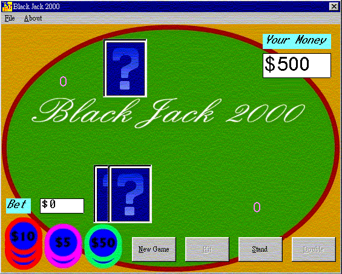



## Black Jack 2000

### Description

This a simple black jack game which is using vbcards.ocx to design and the game is with sound.

This game is very similar to casion black jack. Only the split function is missing. The code zip file is include the vbcards.ocx file. If anyone has download this code, please leave a feed back here or e-mail to kyolinux@sinatown.com
 
### More Info
 

             |
---                |---
**Submitted On**   |2002-08-25 14:51:32
**By**             |[Martin Lam](https://github.com/Planet-Source-Code/PSCIndex/blob/master/ByAuthor/martin-lam.md)
**Level**          |Intermediate
**User Rating**    |4.8 (19 globes from 4 users)
**Compatibility**  |VB 5\.0, VB 6\.0
**Category**       |[Games](https://github.com/Planet-Source-Code/PSCIndex/blob/master/ByCategory/games__1-38.md)
**World**          |[Visual Basic](https://github.com/Planet-Source-Code/PSCIndex/blob/master/ByWorld/visual-basic.md)
**Archive File**   |[Black\_Jack1384029302002\.zip](https://github.com/Planet-Source-Code/martin-lam-black-jack-2000__1-7601/archive/master.zip)

